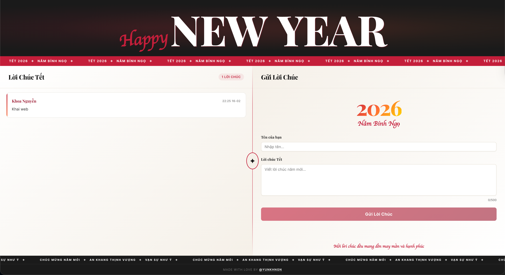

# Lunar New Year 2026

A real-time greeting website for Lunar New Year 2026 with a modern, editorial design.



## Features

- **Real-time Wishes**: Wishes appear instantly using **Firebase Firestore**.
- **Editorial Design**: Magazine-style layout with a luxurious Red/Gold/Cream palette.
- **No Emojis**: Clean and sophisticated aesthetic using design motifs instead of emojis.
- **Confetti Effect**: Celebratory animation upon successful wish submission.
- **Spam Protection**: Rate limited to one wish per minute per user.
- **Responsive**: Beautifully optimized for both desktop and mobile devices.

## Tech Stack

- **Frontend**: [React](https://react.dev/), [Vite](https://vitejs.dev/), [TypeScript](https://www.typescriptlang.org/)
- **Styling**: [Tailwind CSS](https://tailwindcss.com/) v4, [Shadcn UI](https://ui.shadcn.com/)
- **Backend/Database**: [Firebase Firestore](https://firebase.google.com/)
- **Effects**: canvas-confetti, sonner (toast notifications)

## Installation & Setup

1.  **Clone repository**:
    ```bash
    git clone https://github.com/yunkhngn/happy-new-year-2026.git
    cd happy-new-year-2026
    ```

2.  **Install dependencies**:
    ```bash
    npm install
    ```

3.  **Environment Configuration**:
    -   Create `.env` from `.env.example`: `cp .env.example .env`
    -   Fill in your Firebase configuration details in `.env`.

4.  **Run Development Server**:
    ```bash
    npm run dev
    ```
    Access at `http://localhost:5173`.

## Project Structure

```
src/
├── components/         # UI Components (WishList, WishForm, etc.)
├── lib/                # Firebase config and logic (wishes.ts)
├── App.tsx             # Main Layout
├── index.css           # Global styles & Tailwind
└── main.tsx            # Entry point
```

## Author

**@yunkhngn**

If you like this project, please consider supporting me:
-   [Buy Me A Coffee (Lì Xì)](https://buymeacoffee.com/yunkhngn)
-   [GitHub Profile](https://github.com/yunkhngn)

---
*Happy New Year 2026 - Year of the Horse!* 🌸
